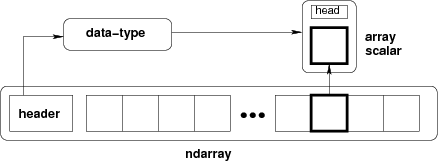

# 数组对象

Numpy提供一个多维数组类型即ndarray,一个相同类型的集合。例如可以使用N个整数来索引整个集合。

所有的ndarray都是同类型的:每个成员都占用相同的内存块，并且所有块都以相同的方法执行。如何执行数组中的成员是由数据类型对象决定，其中一个对象与每个数组关联。除了基础数据类型\( integers, floats, _etc_\)，基础数据还可以表示数据结构。

从数组中提取的成员\(例如：通过索引\)由python对象表示，其类型是numpy中构建的数组标量类型之一。数组标量允许轻松操作更复杂的数据排列。

概念图描述了数组中的数据的三个基本对象之间的关系：1.ndarray本身，2.数据类型\(描述数组的单个固定大小元素的布局\)，3.返回的数据标量python对象\(当访问该数组的单个元素时返回该对象\)

* [多维数组\(ndarray\)](duo-wei-shu-zu-ndarray.md)
  * [构建数组](duo-wei-shu-zu-ndarray.md#gou-jian-shu-zu)
  * [索引数组](duo-wei-shu-zu-ndarray.md#suo-yin-shu-zu)
  * [ndarray内部储存器布局](duo-wei-shu-zu-ndarray.md#ndarray-nei-bu-chu-cun-qi-bu-ju)
  * 数组参数
  * 数组方法
  * 算法，矩阵乘法和对比运算
  * 特殊方法
* 标量 
  * 内置的标量类型
  * 属性
  * 索引
  * 方法
  * 定义新类型
* 数据类型对象\(dtype\)
  * 制定和构造数据类型
  * dtype
* 索引
  * 基本切片和索引
  * 高级索引
  * 详细说明
  * 现场访问
  * 平面迭代器索引
* 迭代数组
  * 单数组迭代
  * 广播数组迭代
  * 将内循环放在Cython中
* 标准数组子类
  * 特殊属性和方法
  * 矩阵对象
  * 内存映射文件数组
  * 字符数组\(numpy.char\)
  * 记录数组\(numpy.rec\)
  * 掩码数组\(numpy.ma\)
  * 标准容器类
  * 数组迭代器
* 掩码数组
  * numpy.ma组件
  * 使用numpy.ma
  * 例子
  * 构建numpy.ma组件
  * MaskedArray类
  * MackedArray方法
  * 掩码数组操作
* 数组接口
  * Python方面
  * C-struct访问
  * 类型描述示例
  * 与数组接口的差异\(version 2\)
* Datetimes 和 Timedeltas
  * 基础日期时间
  * Datetime 和 Timedelta 算法
  * 日期时间单位
  * 工作日方法
  * 改变NumPy 1.11
  * 与1.6和1.7日期时间的差异 

